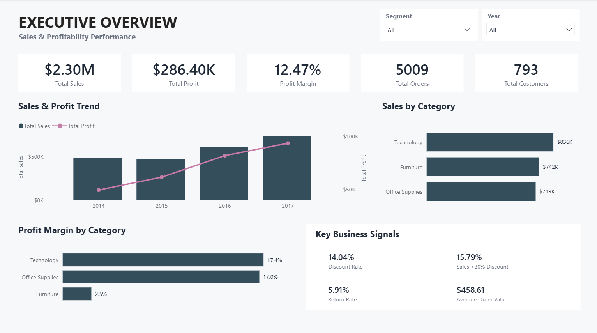
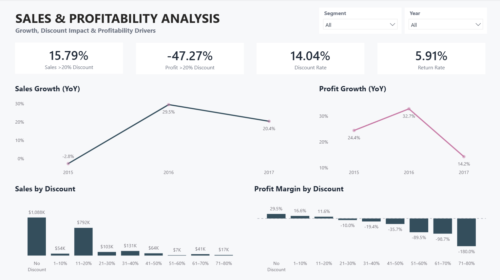
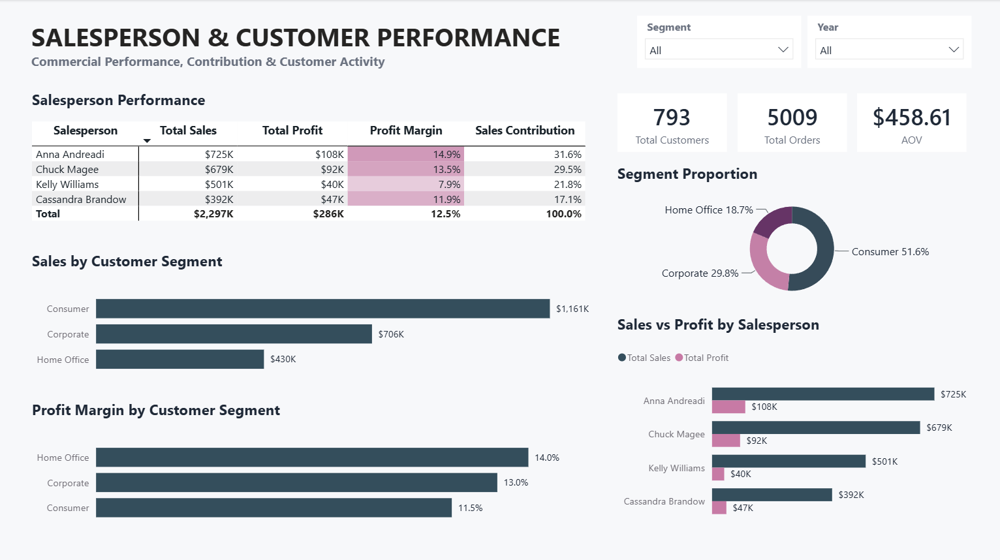

# Retail Supply Chain Sales & Profitability Analytics

An end-to-end Power BI business intelligence project analyzing retail sales, profitability, discount impact, returns, customer segments, and salesperson performance.

The project follows a practical analytics workflow:

**Data Profiling → Data Preparation → Data Modeling → DAX → Business Analysis → Dashboard**


### Dashboard Preview



### Business Objective

The objective of this project is to transform transactional retail sales data into an interactive business intelligence solution that helps stakeholders understand:

- Overall sales and profitability performance
- Year-over-year sales and profit growth
- The impact of discounting on profitability
- Return activity and its financial impact
- Sales performance across customer segments
- Salesperson contribution and profitability
- Customer and order activity

The dashboard is designed to move from **executive-level performance** to **profitability drivers** and finally to **salesperson and customer performance**.

## Project Workflow

The project was developed through the following stages:

1. Data Profiling
2. Data Preparation
3. Power BI Data Modeling
4. DAX Measure Development
5. Business Analysis
6. Interactive Dashboard Development
7. Dashboard Validation & QA

### 1. Data Profiling & Preparation

Initial data profiling and preparation were performed in a Python notebook using **Pandas**.

The notebook was used to understand and validate the dataset before building the Power BI model.

### Profiling included

- Dataset dimensions
- Column inspection
- Data types
- Descriptive statistics
- Missing-value analysis
- Duplicate/data-quality checks
- Data preparation
- Validation of important fields

The prepared data was then brought into Power BI for transformation, modeling, and analysis.

## 2. Data Modeling

The Power BI model follows a **star schema** approach.

### Fact Table

**FactSales**

The fact table contains the transactional sales records and keys required to connect sales transactions with the relevant dimension tables.

### Dimension Tables

The model includes dedicated dimensions for areas such as:

- Date
- Customer
- Salesperson
- Geography
- Product attributes

The model was validated with relationships between the fact and dimension tables before developing the analytical measures.

### Model Validation

Final model checks included:

- **FactSales rows:** 9,994
- **Null Geography Keys:** 0
- **Null Salesperson Keys:** 0
- **Relationships:** 5 created and validated

## 3. DAX & Business Metrics

The project includes a structured DAX measure layer covering core KPIs, growth, discounts, returns, and commercial performance.

**Core KPIs**

- Total Sales
- Total Profit
- Profit Margin
- Total Customers
- Total Orders
- Total Quantity
- Average Order Value

### Growth Analysis

- Previous Year Sales
- YoY Sales Growth %
- Previous Year Profit
- YoY Profit Growth %

### Discount Analysis

- Discount Impact
- Discount Rate %
- Sales Above 20% Discount
- Sales Above 20% Discount %
- Profit Above 20% Discount
- Profit Above 20% Discount %

### Return Analysis

- Returned Sales
- Returned Sales %
- Returned Profit
- Returned Orders
- Return Rate %

### Commercial Performance

- Sales Contribution %
- Salesperson Sales Performance
- Salesperson Profitability
- Customer Segment Sales
- Customer Segment Profit Margin
- Customer Segment Mix

## 4. Dashboard

The Power BI report contains three analytical pages.

### Page 1 - Executive Overview

Provides a high-level view of overall business performance.

**Key areas:**

- Total Sales
- Total Profit
- Profit Margin
- Total Orders
- Total Customers
- Sales & Profit Trend
- Sales by Category
- Profit Margin by Category
- Key Business Signals


### Page 2 - Sales & Profitability Analysis

Focuses on sales growth and the factors affecting profitability.

**Key areas**

- YoY Sales Growth
- YoY Profit Growth
- Discount Rate
- Return Rate
- Sales Above 20% Discount
- Profit Above 20% Discount
- Sales by Discount Band
- Profit Margin by Discount Band



### Page 3 - Salesperson & Customer Performance

Focuses on commercial performance across salespeople and customer segments.

**Key areas:**

- Salesperson Performance
- Sales vs Profit by Salesperson
- Sales by Customer Segment
- Profit Margin by Customer Segment
- Customer Segment Proportion
- Total Customers
- Total Orders
- Average Order Value



## Key Business Insights

### 1. Sales growth accelerated after 2015

Sales declined by approximately **2.83% in 2015**, followed by strong growth of **29.47% in 2016** and **20.36% in 2017**.

### 2. Discounting creates significant profitability pressure

Sales associated with discounts above 20% represent approximately **15.79% of total sales**, while profit associated with those sales is **-$135,376.06**.

### 3. Profitability deteriorates sharply at higher discount levels

Profit margin decreases progressively as discount levels increase.

The analysis shows a transition from positive to negative profitability beginning in the **21–30% discount band**.

### 4. Returns represent a meaningful source of revenue leakage

Returned sales total approximately **$180,504**, representing **7.86% of total sales**.

### 5. Sales performance is concentrated among the leading salespeople

Anna Andreadi contributes approximately **31.58% of total sales**, followed by Chuck Magee at **29.55%**.

### 6. Sales volume and profitability do not always move together

Customer segments differ in both sales contribution and profit margin, demonstrating why revenue alone is insufficient for evaluating commercial performance.

## Tools & Technologies

- Python
- Pandas
- Jupyter Notebook
- Power BI
- Power Query
- DAX
- Data Modeling
- GitHub

## Repository Structure

```text
Retail-Supply-Chain-Sales-Analytics/
│
├── README.md
│
├── dashboard/
│   └── Retail_Supply_Chain_Sales_Analytics.pbix
│
├── notebook/
│   └── Data_Profiling_and_Preparation.ipynb
│
├── data/
│   └── README.md
│
├── images/
│   ├── dashboard_page_1.png
│   ├── dashboard_page_2.png
│   └── dashboard_page_3.png
│
└── docs/
    ├── data_dictionary.md
    └── dax_measures.md
```
---

<p style="text-align:center; color:skyblue; font-size:18px;">
© 2026 Mostafizur Rahman
</p>
